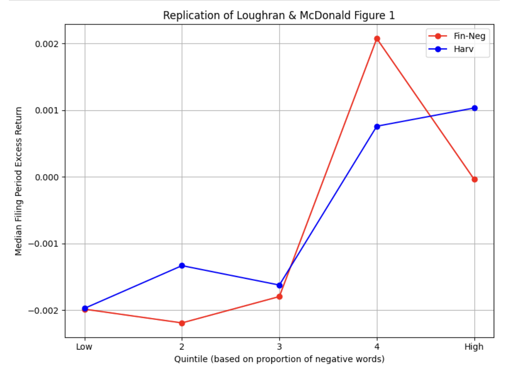

# Replication-andExtension-of-the-Loughran-andMacDonald-analysis-of-10Q-Statements
Assignment 1 - Replication andExtension of the Loughran andMacDonald analysis of 10Q Statements

## 1. Introduction

In Assignment 1, we replicated the Loughran and MacDonald analysis Figure 1.

In the original work done by Loughran and MacDonald in *“When Is a Liability Not a Liability? Textual Analysis, Dictionaries, and 10-K”* , they examines the application of dictionary-based textual analysis in financial disclosures, focusing on the context-dependent meaning of words in 10-K filings. The authors demonstrate that commonly used negative word lists, such as those from general-purpose dictionaries, can misclassify neutral or even positive financial terms—like “liability”—as negative.

By leveraging human annotations and developing a finance-specific dictionary, the study shows that contextual understanding significantly improves the accuracy of tone measurement. The work highlights the importance of domain-specific language models in financial text analysis and provides a methodological foundation for more reliable sentiment-based research in accounting and finance.

Here's some difference of the replication work we done vs. the original work:

- Instead of only 10-K reports, we used most recent S&P 500 companies' 10-K&10-Q reports from 2020 to 2024, covering a five-year-long time with roughly 10,000 documents included.
- Although we resued some of the original codes, the parts of S&P500 companies list and documents' collecting, tf-idf values and weight calculating, data cleaning, figure ploting, ect. are done by codes from ourselves, though all according to the content of the journal.

## 2. Data Collection

During the implementation of this assignment, a lot of data collection work has been done, which is one of the main part of the assignment. Below are some main data we collected:

### 2.1 S&P500 Companies List

Ahead of all the other work, we have to collect the list and date of S&P 500 companies. As S&P500 rebalances its list from time to time, the date that a company is added to or removed from the list is important. And as we have different identifier systems like TICKER, CIK, GVKEY, or PERMNO, we have to switch from different systems when quering data from different databases. Here we didn't use the ticker as it is easier to query using th other three identifiers.

We obtained all these data from WRDS as following steps:

- Get PERMNOs of S&P500 companies, together with their start and end date.
- Get GVKEYs according to the companies PERMNOs from ccmxpf_linktable.
- Get the CIKs of S&P500 companies according to their GVKEYs.

### 2.2 10-K & 10-Q Forms

With the S&P500 companies list, we downloaded 10-K and 10-Q forms of these companies from[ the official website](www.sec.gov).

We downloaded documents from 2020 to 2024, covering 4 quaters a year for totally 5 years. Firstly, we modified EDGAR_Pac.py to download the index files from full-index page, saving the downloading link of each document. Note that for QTR1, many companies would publish their 10-K rather than 10-Q, so we also need to download 10-K forms besides 10-Q.

Then, we modified the EDGAR_DownloadForms file to download the documents we need from the index files we got after checking if the current company is in S&P500 list at the publishing time. To shorten the time cosumed, we removed some restricts of the downloading in the original files, and change the gap(sleep time) to 0.1s.

Finally we got about 10000 files (actually 10100 files as most of the time there are more than 500 companies on the list, and boh 10-K and 10-Q are counted). The documents take much space as about 20GB files are downloaded.

### 2.3 Dictionaries

In this research, we use 2 different dictionaries and compare the result of them.

The first one is Harvard-IV-4 Psychoso-ciological Dictionary, which is one of the earliest and most widely used general-purpose sentiment lexicons in textual analysis. Developed by researchers at Harvard University, it categorizes English words into psychological and sociological dimensions such as positive,  negative,  strong,  weak,  active, and  passive. Originally designed for analyzing social and political texts, it has been adopted across disciplines, including finance, to assess sentiment in textual data. In this research, we mainly use the Harvard-IV-4 TagNeg (H4N) file downloaded from [github](https://github.com/NYU-NLP-Fall2022-SESSION-2/Dictionary/blob/main/Harvard%20IV_Negative%20Word%20List_Inf.txt).

The other one is the financial specific dictionary proposed by Loughran and MacDonald. Likewise we mainly use the negtive-tagged word list from Loughran-McDonald_MasterDictionary. We downloaded it from Google drive link provided by our professor.

### 2.4 Excess Return

To observe the relationship between negative word propotion and excess returns, we need to queiry excess return from the WRDS database.

To download the excess return data, we firstly need to obtain the release date of each document and its company's CIK by analyzing and matching the pattern form the name of the document. Then we connect to WRDS, converting the CIK -> GVKEY -> PERMNO again. Then we use PERMNO to query the return of the specific company and S&P500 during a time window of 3 or 4 starting from the release date. Then we calculated the  buy-and-hold excess return defined by the authors using *BH Return(firm) - BH Return(market).*

The final result is an excess return number calculated for each document.

## 3. Implementation Steps

To replicate the figure 1 in the research, we read the article, the codes provided, and the instructions given by professor carefully. Then we take the follow steps to implement the replication:

### 3.1 Documents Downloading

- Get and save CIK of S&P500 companies by quering the WRDS.
- Download index files for 10-K and 10-Q documents from Government's SEC website, which containing the specific downloading link for each document.
- Download all the 10-K and 10-Q documents of the S&P500 companies according to the index file we get.

### 3.2 Documents Analysis

This is the major part of this research work, containing reading the documents, cleaning up the documents, analyzing the words of documents using different dictionaries and calculating TFIDF values and term weights for each document.

For the two different dictionaries, we firstly create two word list to save the words tagged 'Negative'.  Then we create 3 matrixs, tf_matrix, idf_matrix and doc_length_matrix to save the analysing result.

For the content each document, after reading it, cleaning up all the unrelated characters and convert all the letters to upper letters, we split the content into seperate words. Then we record the presence of the words to the matrix if the word is in the current negative word list. This step is a time consuming one.

Finally, we can calculate the term_weight of all the words in each document according to the definition in the original research, and add them up to get the final weight of every document.

### 3.3 Excess Return Collecting and Comparing

After finishing analyzing the content of documents, we'll need to collect the excess return data and plot figures to verify the result. The window can be set as 3 or 4 when collecting the excess return. We read the term weight from the former results, grouping them into qintiles accoring to the term weight, and drawing figures to compare the results of two dictionaries.

### 3.4 Additional Details

Some details we noticed during this process are as follows:

- To connect and download from WRDS, using the jupyter notebook provided by WRDS is recommended. Otherwise users may fail to connect to WRDS even with your login infomation provided.
- When analyzing the content, make sure to skip some setting files like _DS.store to avoid errors.

## 3. Result and Analysis

The final replication of figure1 we got is as below:

The resulting figure reveals a notably different pattern from the original findings. While Loughran and McDonald report a clear monotonic decline in excess returns as financial negativity increases, our results exhibit a non-monotonic or even reversed relationship, particularly for the Fin-Neg dictionary. Specifically, we observe a positive spike in excess returns in the fourth quintile for Fin-Neg, followed by a decline in the fifth quintile. The Harvard-IV curve shows weaker differentiation across quintiles and greater noise, aligning with prior findings that general-purpose dictionaries perform poorly in financial contexts.

These deviations may be attributed to several factors. First, our sample period (2020–2024) includes highly volatile and unprecedented market conditions, such as the COVID-19 pandemic and its aftermath, which may have disrupted typical investor responses to textual tone. Second, the S&P 500 focus may bias results toward larger, more resilient firms with greater analyst coverage and investor familiarity, potentially muting the effects of tone-based information. Third, while we apply the original weighting scheme, variations in document structure (especially the rise of standardized or boilerplate language in recent filings) may dilute the informativeness of tone scores.

There are some potential ways to improve the uncommon result, which we may try future but not here due to limited time. First, update the dictionary. As time went by, there are new but critical words appeared these years, which are not covered in the former dictionaries we used in the research. One of a good example is words related to COVID-19. Also, we can dig into some particular documents to see the reason leading to the current different result.

Overall, our findings partially replicate the spirit of Loughran and McDonald’s work, confirming the relative superiority of the Fin-Neg dictionary over Harvard-IV in financial contexts. However, the lack of monotonicity in the Fin-Neg curve in our sample period underscores the importance of time-specific market dynamics, dictionary calibration, and potential structural shifts in textual disclosure.
